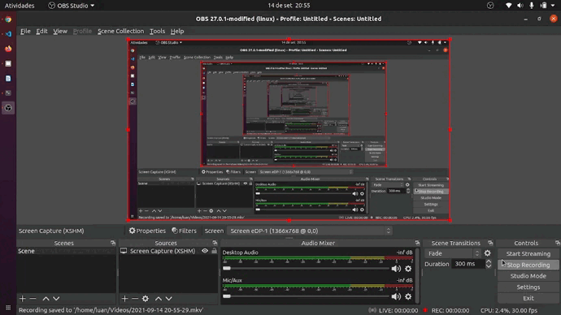

# Dt-Money
[](https://github.com/devsuperior/sds1-wmazoni/blob/master/LICENSE) 

# Sobre o projeto

Projeto desenvolvido durante um curso da Rocketseat.

## Layout web



# Tecnologias utilizadas
## Front end
- ReactJS 
- Style Components 
- Typescript

# Como executar o projeto

## Front end web
Pré-requisitos: npm / yarn

```bash
# clonar repositório
git clone https://github.com/LuanPetruitis/Dt-money.git

# entrar na pasta do projeto front end web
cd Dt-Money

# instalar dependências
npm install

# executar o projeto
yarn start
```

# Autor

Luan Rodrigues Petruitis

https://www.linkedin.com/in/luanpetruitis/
